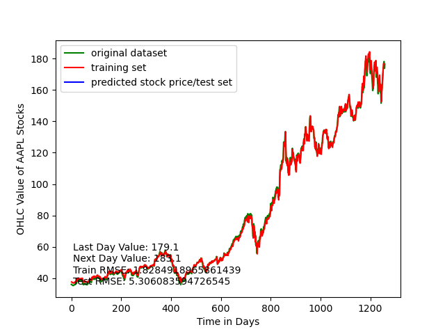
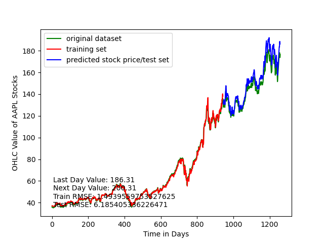

# Stock Price Prediction of Apple Inc. Using Recurrent Neural Network
OHLC Average Prediction of Apple Inc. Using LSTM Recurrent Neural Network

# Dataset:
The dataset is taken from yahoo finance's website in CSV format. The dataset consists of Open, High, Low and Closing 
Prices of the 20 tickers identified in our project proposal. Stock data is from 4th April 2017 to 4th April 2022. 
# Price Indicator:
Stock traders mainly use three indicators for prediction: OHLC average (average of Open, High, Low and Closing Prices),
HLC average (average of High, Low and Closing Prices) and Closing price, In this project, OHLC average has been used.
# Data Pre-processing:
After converting the dataset into OHLC average, it becomes one column data. This has been converted into two column time
series data, 1st column consisting stock price of time t, and second column of time t+1. All values have been normalized
between 0 and 1.
# Model: 
Two sequential LSTM layers have been stacked together and one dense layer is used to build the RNN model using Keras 
deep learning library. Since this is a regression task, 'linear' activation has been used in final layer.
# Version:
Python 3.7 and latest versions of all libraries including deep learning library Keras and Tensorflow.
# Training:
All data except for the last 3 or 7 days is used for training. Adagrad (adaptive gradient algorithm) optimizer is used 
for faster convergence.
After training starts it will look like:

# Test:
Test accuracy metric is root mean square error (RMSE).
# Results:
The comparison of OHLC, HLC and Closing price:

After the training the fitted curve with original stock price:
with 32 LSTMs

with 64 LSTMs

75% training, 25% testing 

# Observation and Conclusion:
Our experiments with LSTMs and the prediction of stock prices resulted in several hypotheses, but an overall conclusion
that LSTMs are very well-suited to handle the nature of stock price prediction. We discovered several important results
from our experiments. Overall, RNNs using LSTM units and a dense layer predicted better and with less error using data 
obtained daily, instead of weekly, and heavily outperformed a control group trained on 75% of the data. We also noticed 
that on a 32 LSTM top-layer configuration, the network trained on daily data with 3 days of prediction performed 
consistently better. We believed this was because of the increased frequency of the data and proximity to the final 
prediction date, allowing the model to better learn trends and apply them. We discovered a single industry trend in the 
Technology industry, where networks trained on weekly data consistently outperformed the networks trained on daily data.
We believed this was due to volatility in the technology indus-try, and weekly data better capturing average trends 
instead of possible spikes or falls due to volatility. Finally, we established that between two configurations of the 
networks (64 LSTMs in the top layer and 32 LSTMs in the top layer), the first (64 LSTM) configuration performed the 
best, matching that of the second (32 LSTM) configuration for weekly and daily 3-Day net-works, but majorly performing 
better for the daily 7-Day network. We hypothesized that this was because more LSTM units could increase the capability 
of the network to accurately predict prices over gaps in time-series data. Overall, we learned of the unique 
capabilities of LSTM networks to learn from time-series data and predict values in the future. Through our experiments, 
we were able to see the effects of increasing the numbers of LSTM units in our RNNs and how we could feed these 
networks' data to optimize their predictive capabilities. We also learned a great deal about how time-series data gets 
handled with gaps in data between model learning and prediction. In this, we were able to determine that these gaps are 
processed in a more in-depth manner with more LSTMs and our results show models trained with larger gaps are more 
accurately trained and with less error with more LSTMS. We also learned about how to design LSTM networks with 
time-series data in mind and how to prepare the data they would use. Another important thing we learned is how data 
frequency and learning can affect model accuracy/error in the scope of time-series data, and how these can lead to huge 
differences in prediction. All in all, our experiments to predict stock prices were successful, and we noticed 
meaningful trends within our dataset.

# How to Run the code
1) List the stock symbols/tickers in ticker_list.csv ensuring that you give each ticker an index with a comma separating
the index and the symbol.
2) Set the start date, end date, and data interval in path_tester.py and run it. This uses data_retriever to get the 
stock tickers from ticker_list.csv and then retrieve the associated data from yahoo finance and puts them into separate 
csvs for each ticker.   
3) Run deDup.py and tester.py to ensure that there is no duplicate data in the dataset and that the data is in the 
proper order.
4) Set the parameters that you would like for LSTM layers and run StockPricePrediction.py
